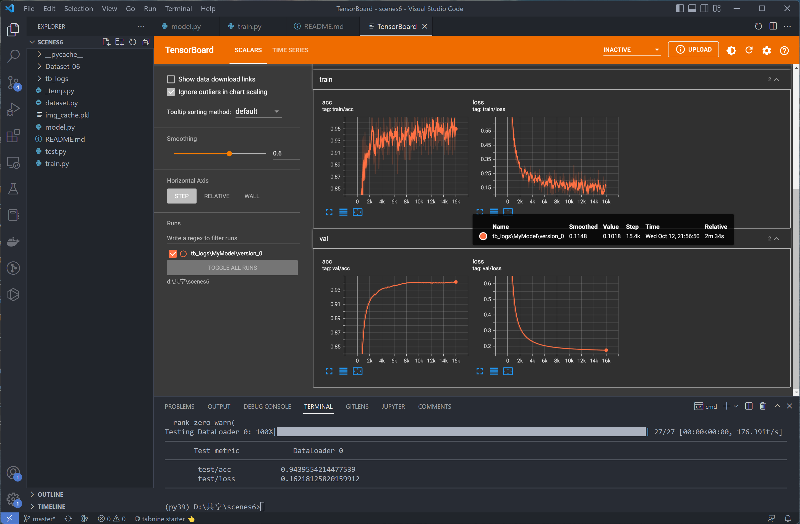

## 场景分类器

### 整体流程

图片 --- ViT ---> 特征向量[768] --- MyModel ---> 分类向量[6]

### 结果

学习率0.000001，权重随机初始化运行200轮，在测试集上场景图片分类准确度能达到94.39%。



### 运行环境

```Powershell
# 安装 Miniconda
# https://docs.conda.io/en/latest/miniconda.html

# 创建 python3.9 虚拟环境
conda create --name py39 python=3.9
conda activate py39 

# 安装 pytorch 以及相关依赖
# 训练推荐安装 GPU 版，需要 Nvidia 显卡
conda install pytorch torchvision torchaudio cudatoolkit=11.3 -c pytorch
# 仅运行模型也可选择 CPU 版
# conda install pytorch torchvision torchaudio cpuonly -c pytorch

# 安装其它依赖包
pip install pytorch-lightning
pip install einops
pip install matplotlib
pip install torchmetrics
pip install tqdm
pip install tensorboard
```

### 数据集

数据集位于`dataset/Dataset-06`文件夹中，各类图片放置在不同文件夹内，通过`dataset.py`载入。

```
+---dataset
    +---Dataset-06
        +---01_buildings
        +---02_forests
        +---03_glacier
        +---04_mountains
        +---05_sea
        \---06_street
```

数据集被随机6:2:2分割为训练集、验证集和测试集。

### 训练

```Powershell
# 训练模型
python train.py

# 启动训练图表面板
tensorboard --logdir .
```

### 测试

如果需要准确度（Accuracy）外的其它指标，可以参考：[all-metrics](https://torchmetrics.readthedocs.io/en/stable/all-metrics.html)

所有Classification类型的指标都可以添加。

```Powershell
# 测试模型
python test.py
```

### HTTP 服务

使用以下命令启动HTTP服务器，默认监听在`http://localhost:3000`，使用HTTP POST上传任意图片即可获得分类结果，正确返回`0`~`5`，错误返回`-1`。

服务端使用CPU计算约1秒，GPU约0.1秒。

```Powershell
# 启动服务
python server.py

# 上传图片获得结果
curl --request POST --data-binary @pics/1.jpg localhost:3000
```

```C#
// Unity 调用例子
using System.Collections;
using UnityEngine;
using UnityEngine.Networking;
using UnityEngine.Windows;

public class Test : MonoBehaviour
{
    void Start()
    {
        StartCoroutine(Post());
    }

    IEnumerator Post()
    {
        var data = File.ReadAllBytes(@"pics\1.jpg");
        using (var req = new UnityWebRequest("http://localhost:3000", UnityWebRequest.kHttpVerbPOST))
        {
            req.uploadHandler = new UploadHandlerRaw(data);
            req.downloadHandler = new DownloadHandlerBuffer();
            yield return req.SendWebRequest();

            Debug.Log(req.downloadHandler.text);
        }
    }
}
```
